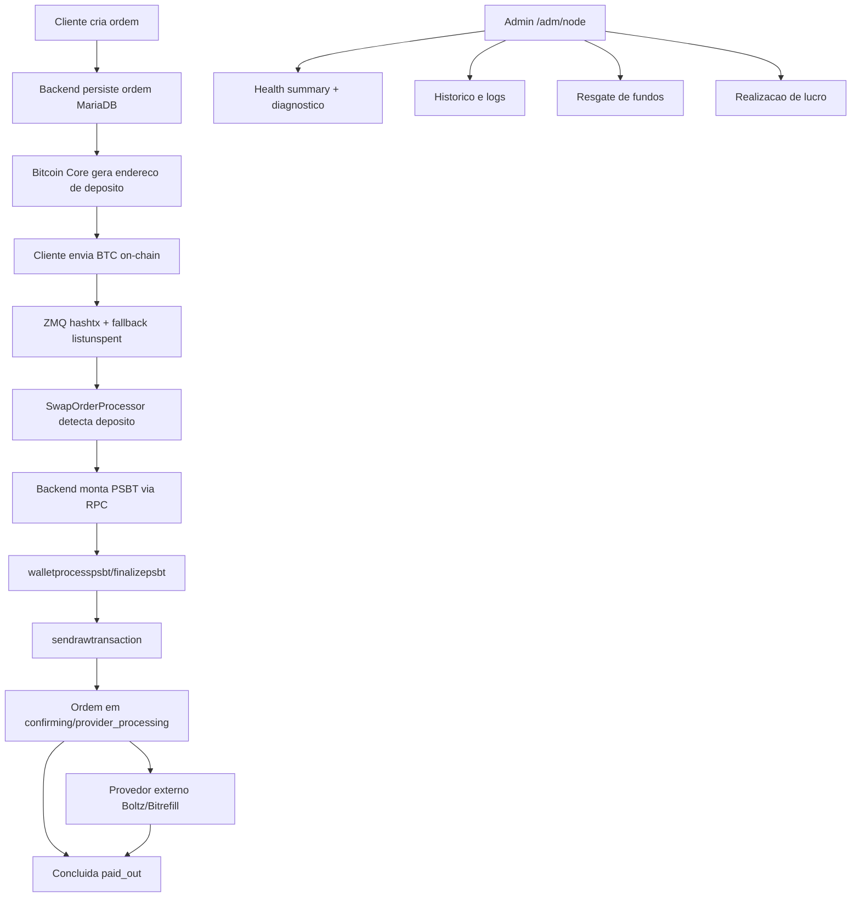

# ZeroConf Prop

Aplicação do hackathon **CoreCraft (Bitcoin Coders)** que usa **Bitcoin Core como backend real** para operações de troca/pagamento com UX de cliente e operação administrativa.

O objetivo é simples: provar um fluxo utilizável, auditável e rápido, com:

- **Bitcoin Core** (JSON-RPC + ZMQ)
- **FastAPI** (orquestração de negócio)
- **React** (cliente e admin)
- **MariaDB** (persistência operacional)
- **Caddy** (HTTPS/proxy)

---

## Visão geral da aplicação

### Área Cliente (`/cliente`)

- Criar ordem de envio on-chain
- Criar swap Lightning via Boltz
- Criar compra via Bitrefill
- Ver progresso da ordem, status externo, timeline BRT e dados técnicos (em signet)

### Área Administrativa (`/adm`)

- Node tools: chain/wallet/ZMQ + painel de saúde + diagnóstico 1-clique
- Histórico de trocas + logs
- Resgate de fundos travados por UTXO
- Realização de lucro (saque administrativo com senha master e trilha RPC)

---

## Arquitetura e pastas

- `docker-compose.yml` (raiz): serviço `bitcoind` e rede `bitcoin-coder-net`
- `infra/bitcoin/bitcoin.conf`: config do Core (RPC + ZMQ + prune)
- `stack/docker-compose.yml`: backend, frontend, MariaDB, Caddy
- `stack/backend/`: API e lógica de negócio
- `stack/frontend/`: aplicação web cliente/admin
- `stack/infra/caddy/Caddyfile`: TLS interno + reverse proxy

---

## Montagem rápida (local)

### 1) Preparar variáveis de ambiente

```bash
cp .env.example .env
cp stack/.env.example stack/.env
```

Preencha no mínimo:

- **raiz `.env`**: `BITCOIN_RPC_USER`, `BITCOIN_RPC_PASSWORD`, host/porta de bitcoind
- **`stack/.env`**:
  - `SECRET_KEY`
  - `ADM_BOOTSTRAP_PASSWORD`
  - `BITCOIN_OPERATOR_WALLET`
  - `ADM_MASTER_WITHDRAW_PASSWORD` (saque lucro)
  - (opcional) `BITREFILL_*` e `BOLTZ_*`

### 2) Subir Bitcoin Core (raiz)

```bash
docker compose up -d
```

### 3) Subir stack da aplicação

```bash
cd stack
docker compose up -d --build
```

### 4) Verificar saúde

```bash
curl http://localhost:8200/health
```

### 5) Abrir UI

- Público/cliente: `https://localhost:9443/cliente`
- Admin: `https://localhost:9443/adm`

> Certificado é `tls internal` no Caddy; aceite o aviso no browser em ambiente local.

---

## Papel do Bitcoin Core (RPC) em cada fluxo

## 1) Fluxos de cliente

### Envio on-chain (`provider=internal`)

- `getnewaddress`: gera endereço único de depósito por ordem
- `listunspent`: detecta fundos no endereço da ordem
- `walletcreatefundedpsbt` + `walletprocesspsbt` + `finalizepsbt`: monta/assina tx de payout
- `sendrawtransaction`: transmite payout
- `gettransaction`: atualiza estado de confirmação

### Swap Lightning (Boltz)

- Core faz a perna on-chain do swap:
  - endereço de depósito local via `getnewaddress`
  - detecção de depósito via `listunspent`/ZMQ
  - envio para lockup da Boltz via PSBT + `sendrawtransaction`
- Boltz retorna status externo (`status_raw`) e preimage; estado local é sincronizado.

### Compras (Bitrefill)

- Core recebe depósito do cliente e financia pagamento on-chain da invoice Bitrefill:
  - detecção de depósito
  - construção/assinatura/envio da tx
  - confirmação de conclusão no estado da ordem

## Papel do ZMQ nos fluxos

O ZMQ do Bitcoin Core é usado como **canal de evento em tempo real** (principalmente `hashtx` e `hashblock`) para reduzir latência operacional.

### Onde ele entra

- Quando uma transação entra na mempool e toca a wallet do operador, o relay ZMQ publica evento.
- O backend (`SwapOrderProcessor`) reage ao evento para casar a ordem e iniciar o processamento do payout mais cedo.
- Resultado prático: o sistema costuma sair de `awaiting_deposit` para estados seguintes sem esperar ciclos longos de polling.

### ZMQ vs polling (fallback)

- **ZMQ é o caminho preferencial** para velocidade.
- **Polling continua existindo** (`listunspent` via watcher/recovery) como fallback para:
  - perda de evento
  - reconexão de serviço
  - cenários de rede instável

Ou seja: não é “ZMQ ou polling”; é **ZMQ first + polling safety net** para robustez.

---

## 2) Fluxos administrativos

### Saúde e diagnóstico do node

- `getblockchaininfo`: estado da chain, blocks/headers/lag
- `getmempoolinfo`: mempool size e mempoolminfee
- `getwalletinfo` + `listwallets`/`loadwallet`/`createwallet`: estado da carteira operacional
- Snapshot de ZMQ relay (último evento, conectado/desconectado)

### Resgate de fundos

- `listunspent`: identifica UTXOs presos no endereço de depósito da ordem
- `walletcreatefundedpsbt` + `walletprocesspsbt` + `finalizepsbt` + `sendrawtransaction`
- Retorno inclui detalhe RPC para auditoria operacional

### Realização de lucro (saque admin)

- Escopo: **somente UTXOs do endereço índice 0 (`fee-index-0`)**
- Regra: envia 90% para destino, taxa 3 sat/vB, troco no índice 0
- Pipeline RPC:
  - `validateaddress`
  - `listunspent` (fee-index-0)
  - `walletcreatefundedpsbt`
  - `walletprocesspsbt`
  - `finalizepsbt`
  - `sendrawtransaction`

---

## Fluxograma da aplicação



---

## Operação e comandos úteis

### Reiniciar serviços sem rebuild

```bash
docker compose -f stack/docker-compose.yml restart backend
docker compose -f stack/docker-compose.yml restart frontend
```

### Rebuild (quando mudar dependências/Dockerfile)

```bash
cd stack
docker compose up -d --build
```

### Testes backend

```bash
cd stack
docker compose exec -T backend pip install -r requirements-dev.txt
docker compose exec -T backend sh -lc 'PYTHONPATH=/app pytest tests/'
```

---

## Segurança operacional

- Não expor RPC do Bitcoin Core na internet pública sem proteção.
- Não commitar segredos (`SECRET_KEY`, senhas admin, chaves API, master password).
- Use carteira operacional dedicada (`BITCOIN_OPERATOR_WALLET`).
- Em produção, usar TLS válido e `COOKIE_SECURE=1`.

---

## Evoluções recomendadas

- Métricas e alertas externos (Prometheus/Grafana ou Datadog)
- Retentativa com fila para integrações externas (Boltz/Bitrefill)
- Jobs assíncronos com backoff persistente
- RBAC admin (perfis e trilha de auditoria completa por usuário)
- Testes e2e de fluxos críticos com cenários de falha RPC
- Política explícita de fees dinâmica por ambiente/rede

---

## Status do MVP

Este repositório já entrega um MVP operacional completo para demo técnica:

- Fluxo cliente utilizável
- Operação administrativa real
- Integração Bitcoin Core ponta a ponta
- Observabilidade mínima com diagnóstico e workers internos
